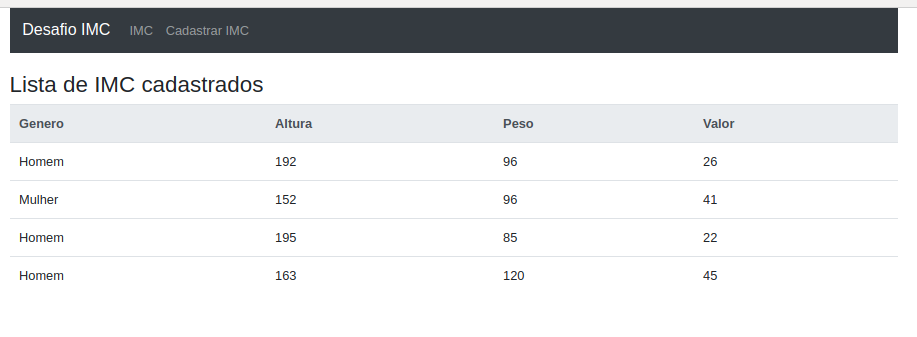
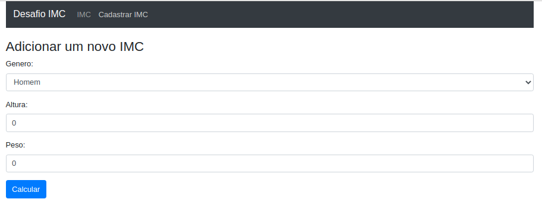

# desafio-imc-vincer

fazendo atualiza de estrutura para HEROKU

 **Backend NodeJS**
 
GitHub = https://github.com/oavandre/backend-imc-nodejs-mongodb-api

Heroku = https://backend-imc-nodejs-mongodb-api.herokuapp.com/imc/

**FrontEnd ReactJS**

GitHub = https://github.com/oavandre/frontend-imc-ReactJS

Heroku = https://frontend-imc-reactjs.herokuapp.com/

Desafio para desenvolvedor Fullstack

http://desafioimc.oav.company/

**Visao Geral**
- [Backend RoR] (Não concluído)
    - [Ruby](# v2.5.1p57 )
    - [Rails](# v4.2.10 )
 - [Backend NodeJS] 
    - [NodeJS](# v8.17.0 )
- [FrontEnd]
    - [ReactJS](# v )
- [DB]
    - [MongoDB](# v4.0.0 )

# MongoDB

Resolvir mudar para banco de dados local para Online pra ser usado no BI
mongodb+srv://oav:<pa7663GE>@cluster0.wg0hr.mongodb.net/<dbname>?retryWrites=true&w=majority

mongodb://localhost:27017/imc

bind_ip = 127.0.0.1
port = 27017

dbpath=/var/lib/mongodb

**verificar se o mongoDB esta ativo**
$ sudo systemctl status mongodb

**deixar ativo quando reiniciar**
$ systemctl enable mongodb
$ vim /etc/mongodb.conf

# Ruby on Rails

rails s -b 127.0.0.1

**testes API**
POST 192.168.196.134:5000/genero/add/
genero:Homem

GET 192.168.196.134:3003/genero/

# PowerBI
https://app.powerbi.com/reportEmbed?reportId=10296788-8f13-4d82-8e3f-bf9a818cbdb2&groupId=5a3f1e9b-4266-469a-b389-5a68b3eab515&autoAuth=true&ctid=2320ab9a-0d61-4a5e-8c22-caa193c26a41&config=eyJjbHVzdGVyVXJsIjoiaHR0cHM6Ly93YWJpLWJyYXppbC1zb3V0aC1iLXByaW1hcnktcmVkaXJlY3QuYW5hbHlzaXMud2luZG93cy5uZXQvIn0%3D

<iframe width="1140" height="541.25" src="https://app.powerbi.com/reportEmbed?reportId=10296788-8f13-4d82-8e3f-bf9a818cbdb2&groupId=5a3f1e9b-4266-469a-b389-5a68b3eab515&autoAuth=true&ctid=2320ab9a-0d61-4a5e-8c22-caa193c26a41&config=eyJjbHVzdGVyVXJsIjoiaHR0cHM6Ly93YWJpLWJyYXppbC1zb3V0aC1iLXByaW1hcnktcmVkaXJlY3QuYW5hbHlzaXMud2luZG93cy5uZXQvIn0%3D" frameborder="0" allowFullScreen="true"></iframe>

